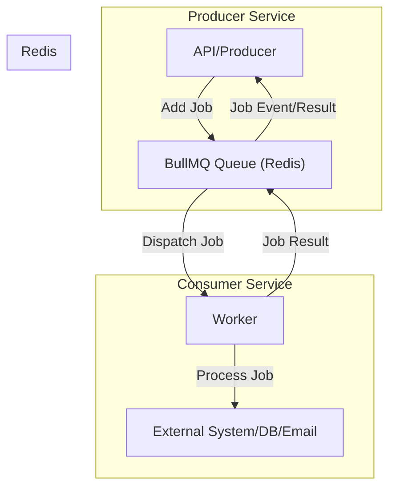
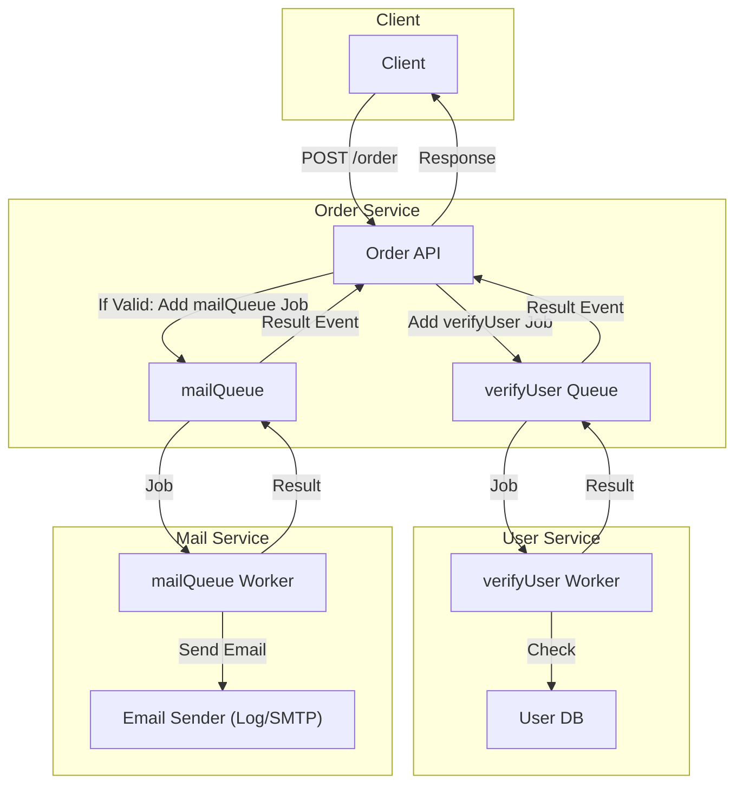

# BullMQ Microservices Demo

## Table of Contents
- [Overview](#overview)
- [What is BullMQ?](#what-is-bullmq)
- [Why Use BullMQ?](#why-use-bullmq)
- [Project Use Case](#project-use-case)
- [How BullMQ is Used Here](#how-bullmq-is-used-here)
- [Architecture](#architecture)
  - [Basic Architecture](#basic-architecture)
  - [User Flow Architecture](#user-flow-architecture)
- [Setup & Running the Project](#setup--running-the-project)
- [API Usage](#api-usage)
- [Extending the Project](#extending-the-project)
- [License](#license)

---

## Overview
This repository demonstrates a simple microservices architecture using [BullMQ](https://docs.bullmq.io/) for distributed job queues and background processing. The system consists of three Node.js services:
- **Order Service**: Accepts orders and coordinates user verification and email notification.
- **User Service**: Verifies user existence and validity.
- **Mail Service**: Sends order confirmation emails.

All services communicate asynchronously via Redis-backed BullMQ queues.

---

## What is BullMQ?
**BullMQ** is a fast, robust, and feature-rich queue system for Node.js, built on top of Redis. It allows you to offload time-consuming or resource-intensive tasks to background workers, enabling scalable and resilient distributed systems.

**Key Features:**
- Distributed job processing
- Delayed/repeatable jobs
- Job events and progress tracking
- Rate limiting and concurrency control
- Persistence and reliability (thanks to Redis)

---

## Why Use BullMQ?
- **Decoupling**: Services can communicate via queues without direct HTTP calls.
- **Scalability**: Workers can be scaled independently.
- **Reliability**: Jobs are persisted in Redis and can be retried on failure.
- **Performance**: Handles high-throughput workloads efficiently.

---

## Project Use Case
This project simulates a real-world scenario where:
- An order is placed by a user.
- The system verifies if the user is valid.
- If valid, an order confirmation email is sent.

This pattern is common in e-commerce, booking, and notification systems.

---

## How BullMQ is Used Here
- **Queues**:
  - `verifyUser`: Used by the order service to request user verification from the user service.
  - `mailQueue`: Used by the order service to request email sending from the mail service.
- **Workers**:
  - The user service runs a worker that processes `verifyUser` jobs.
  - The mail service runs a worker that processes `mailQueue` jobs.
- **Events/Results**:
  - The order service waits for job completion and results using BullMQ's job events and result propagation.

---

## Architecture

### General BullMQ Architecture & Flow

A professional overview of a typical BullMQ-based microservices system, showing clear separation of producer, queue, worker, and external systems.



- **Producer Service**: Adds jobs to the queue.
- **Redis**: Persists and manages the queue.
- **Consumer Service**: Worker processes jobs and interacts with external systems.
- **Events/Results**: Results/events are sent back to the producer.

---

### This App: User Order & Email Flow

A professional, stepwise flow for this app, showing all services, queues, and the direction of data and events.



**Legend:**
- **Order Service**: Orchestrates the flow.
- **User Service**: Verifies users.
- **Mail Service**: Sends emails.
- **Arrows**: Show the direction of data, jobs, and results.

---

## Setup & Running the Project

### Prerequisites
- [Node.js](https://nodejs.org/) (v16+ recommended)
- [npm](https://www.npmjs.com/)
- [Redis](https://redis.io/) (running on `localhost:6379`)
  - You can use [Docker](https://hub.docker.com/_/redis):
    ```sh
    docker run --name redis -p 6379:6379 -d redis
    ```

### Install Dependencies
In each service directory (`order-server`, `user-server`, `mail-server`):
```sh
cd <service-directory>
npm install
```

### Start All Services
Open three terminals and run:
```sh
cd order-server && npm start
cd user-server && npm start
cd mail-server && npm start
```

---

## API Usage

### Place an Order
**Endpoint:** `POST http://localhost:3000/order`

**Request Body:**
```json
{
  "orderId": 123,
  "productName": "Widget",
  "price": 19.99,
  "userId": 2
}
```

**Response (if user is valid):**
```json
{
  "message": "User is Valid",
  "mailStatus": "Email sent",
  "rest": {
    "id": 2,
    "name": "TOM",
    "email": "tom@doe.com"
  }
}
```

**Response (if user is not valid):**
```json
{
  "message": "User is not Valid"
}
```

---

## Extending the Project
- Add more services (e.g., payment, inventory) using new queues and workers.
- Integrate a real email provider in the mail service.
- Add authentication and authorization.
- Use a persistent database for users and orders.
- Add monitoring and dashboards (BullMQ UI, RedisInsight).

---

## License
MIT 